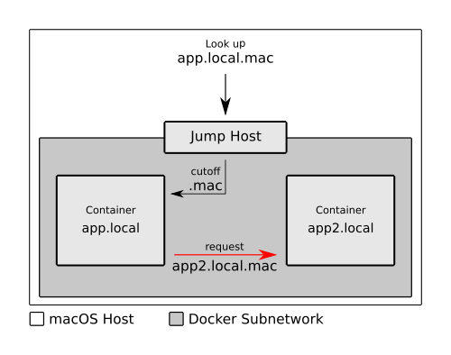

[](https://travis-ci.org/hausgold/libnss-mac-mdns)
[](https://codeclimate.com/repos/5cac8d906969c3778e00948f/maintainability)
[](https://codeclimate.com/repos/5cac8d906969c3778e00948f/test_coverage)

This project is dedicated to enable containers on a Docker subnetwork to lookup
macOS compatible mDNS domain names by the low level Name Service Switch (NSS).
So when a request from the host system is routed into the Docker subnetwork,
with a domain like `app.local.mac` and the compatibility jump host was able to
resolve the correct mDNS domain (`app.local`) everything is fine. But when the
subnetwork internal applications start using the macOS compatibility domain
(`.mac` suffix), things get messy. The lookup is doomed to fail, because nobody
responds to the `.mac` suffix domain. Thats where this plugin jumps into. We
allow domain resolution with the `.mac` suffix in place by using the Avahi
client, just like a jump host.

- [Requirements](#requirements)
- [Usecase](#usecase)
- [Getting started](#getting-started)
- [Usage](#usage)
- [Testing](#testing)
- [Contributing](#contributing)
- [Credits](#credits)

## Requirements

* [GNU Make](https://www.gnu.org/software/make/) (>=4.2.1)
* [GCC](http://gcc.gnu.org/) (>=7.2.1)
* [glibc](http://www.gnu.org/software/libc) (>=2.26)
* [glib2](https://wiki.gnome.org/Projects/GLib) (>=2.54.2)

## Usecase



## Getting started

First you need to clone this repository from Github:

```bash
# Clone the repository
$ git clone https://github.com/hausgold/libnss-mac-mdns.git
# Go in the repository directory
$ cd libnss-mac-mdns
```

We assume you have prepared the requirements in advance. The only thing
which is left, is to build, install and use the NSS plugin:

```bash
# Build the NSS plugin from source
$ make build
# Install the NSS plugin into your system
$ sudo make install
```

After the successful installation of the plugin you can configure it. Just edit
your `/etc/nsswitch.conf` file with system permissions and change the `hosts`
configuration like this:

```
hosts: [..all your stuff..] mac_mdns
```

Just make sure that `mac_mdns` is before `dns`.

## Usage

We assume you have a running mDNS stack on every Docker container you use,
and/or on your host system is an Avahi mDNS server running.  Just make sure
your mDNS stack is working properly and can resolve domains like `app.local`.

When you installed and configured the libnss-mac-mdns library, you can start
resolving `.mac` suffixed domains.

```bash
# Lookup a regular mDNS domain
$ getent hosts app.local
# => 172.17.0.17

# Lookup the macOS compatibility domain
$ getent hosts app.local.mac
# => 172.17.0.17
```

As you can see here, we just allow both resolutions, without touching the mDNS
configuration at all.

## Testing

So if you like to start developing, just make your changes, and run `make test`
and you should be able to validate your changes.  The only requirement to make
this work, is the configuration on the `/etc/nsswitch.conf` file, just like
described above. (hard requirement for the tests)

## Contributing

Bug reports and pull requests are welcome on GitHub at
https://github.com/hausgold/libnss-mac-mdns.

## Credits

This project was heavily inspired by [Danielle Madeley excellent docker-nss
library](https://github.com/danni/docker-nss).  We also had a deeper look at
the following projects to get our thing going:

* https://github.com/lathiat/nss-mdns
* https://github.com/ryandoyle/nss-etcd
* https://github.com/goneri/libnss-openvpn
* https://github.com/resin-io-modules/libnss-openvpn-rs (We started with Rust)
